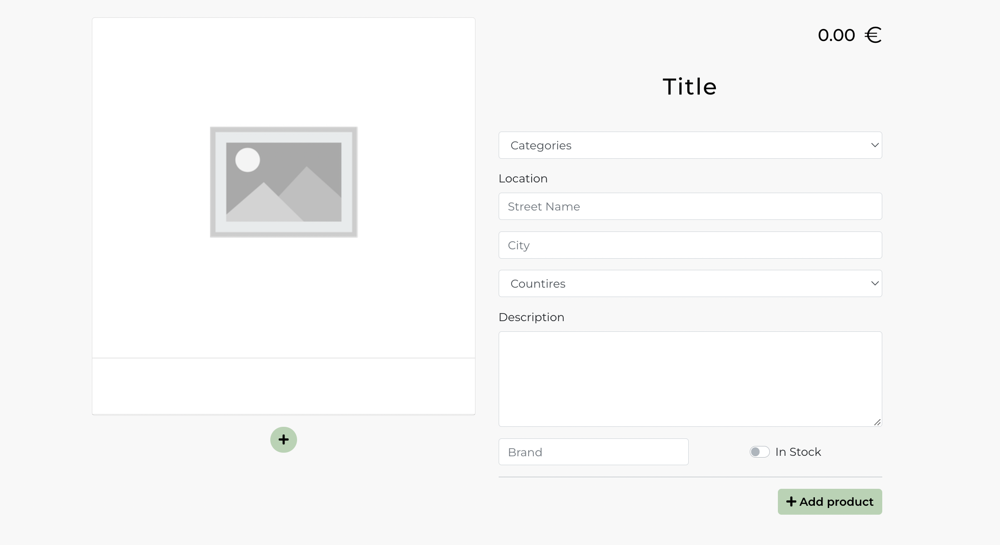

# <div align='center'> Cutback :surfer: <!-- omit in toc --> </div>

## **Contents**

- [**Contents**](#contents)
- [**About**](#about)
- [**Project Goals**](#project-goals)
- [**User Stories**](#user-stories)
- [**Technologies Used**](#technologies-used)
- [**Project Architecture**](#project-architecture)
- [**Features**](#features)
  - [Existing Features](#existing-features)
  - [Features Left to implement](#features-left-to-implement)
- [**UX Design**](#ux-design)
  - [Color Scheme](#color-scheme)
  - [Typography](#typography)
  - [Wireframes](#wireframes)
- [**Deployment**](#deployment)
  - [Backend](#backend)
  - [Frontend](#frontend)
- [**Credits**](#credits)
- [**Acknowledgments**](#acknowledgments)

## **About**

---

The Cutback is a web application which allows users to compare surfing equipment and find the best deal for themselves. This project is built to help surfers trade their gear and encourage them to use second-hand equipment.

Users can create posts with a gear they want to trade, but also compare products by the comments and 5-star rating system. All they need to do is create an account with an existing email.

With an authorised profile, they are ready to help save our planet by taking part in a reusable community.

[Back to contents](#contents)

## **Project Goals**

---

1. Build a project to help compare surfing equipment.
2. Help users to choose the best product they are looking for.
3. Create a platform with easy access to products.
4. Design a layout that is intuitive and focuses on content.
5. Allow for responsiveness on different screen sizes to reach a further audience.
6. Require an account for posting product offers to avoid fraudsters.
7. Increase offers reliability with the use of pictures.
8. Give users quick access to the best offers.
9. Create a platform for modern needs.
10. Allow users to filter products by useful features.
11. Give users the ability to vote and comment on the products.

[Back to contents](#contents)

## **User Stories**

| Issue ID    | User Story | Project Goal |
| :------------:| --------------- | ---------- |
| [#1](https://github.com/miloszmisiek/ci-p5-cutback/issues/1)   | As a user I can access the site's navigation from every page so that I can visit every page quickly all the time | **3. Create a platform with easy access to products.**, <br/> <br/> **4. Design a layout that is intuitive and focuses on content.**
| [#2](https://github.com/miloszmisiek/ci-p5-cutback/issues/2)   | As a user I can create a new account so that I have access to all features for registered users | **6. Require an account for posting product offers to avoid fraudsters.**
| [#3](https://github.com/miloszmisiek/ci-p5-cutback/issues/3)   | As a user I can sign in to the website so that I can use all features for logged-in users | **6. Require an account for posting product offers to avoid fraudsters.**
| [#4](https://github.com/miloszmisiek/ci-p5-cutback/issues/4)   | As a user I can see my login status so that I can take action and log in if required | **6. Require an account for posting product offers to avoid fraudsters.**
| [#5](https://github.com/miloszmisiek/ci-p5-cutback/issues/5)   |As a user, I can remain logged in until I decide to log out so that my session remains valid, and I can enjoy browsing the website without extra login actions | **3. Create a platform with easy access to products.**, <br/>  <br/> **9. Create a platform for modern needs.**
| [#8](https://github.com/miloszmisiek/ci-p5-cutback/issues/8)   |As a user I can navigate through different pages smoothly so that I can explore site content without page refreshing | **3. Create a platform with easy access to products.**, <br/> <br/> **4. Design a layout that is intuitive and focuses on content.**, **9. Create a platform for modern needs.**
| [#9](https://github.com/miloszmisiek/ci-p5-cutback/issues/9)   | As a logged-out user I can see the sign-in and sign-up buttons so that I can change my login status | **6. Require an account for posting product offers to avoid fraudsters.**
| [#10](https://github.com/miloszmisiek/ci-p5-cutback/issues/10)   | As a logged-in user I can see the Profile dropdown menu in the navbar so that I can have access to all relevant profile features from every page | **4. Design a layout that is intuitive and focuses on content.**
| [#12](https://github.com/miloszmisiek/ci-p5-cutback/issues/12)   | As a logged-in user I can rate a product so that I can share my experience about a product and position it higher in ranks | **1. Build a project to help compare surfing equipment.**, <br/> <br/> **2. Help users to choose the best product they are looking for.**, **11. Give users the ability to vote and comment on the products.**
| [#16](https://github.com/miloszmisiek/ci-p5-cutback/issues/16)   | As a logged-in user I can create products so that notice other users about my gear offer | **1. Build a project to help compare surfing equipment.**
| [#17](https://github.com/miloszmisiek/ci-p5-cutback/issues/17)   | As a user, I can view the product details so that I have a better judgment on the offer | **2. Help users to choose the best product they are looking for.**
| [#18](https://github.com/miloszmisiek/ci-p5-cutback/issues/18)   | As an owner of the product I can edit product details so that I can guarantee that the product details are latest and up-to-date | **10. Allow users to filter products by useful features.**
| [#19](https://github.com/miloszmisiek/ci-p5-cutback/issues/19)   | As an owner of the product I can delete my products so that I can control what products am I displaying as an offer | **2. Help users to choose the best product they are looking for.**
| [#21](https://github.com/miloszmisiek/ci-p5-cutback/issues/21)   | As a logged-in user I can post comments on the products so that I can share my insights about the product or write a review about the offer | **1. Build a project to help compare surfing equipment.**, <br/> <br/> **2. Help users to choose the best product they are looking for.**, <br/> <br/> **11. Give users the ability to vote and comment on the products.**
| [#22](https://github.com/miloszmisiek/ci-p5-cutback/issues/22)   | As a user, I can read product's comments so that I can compare my thoughts about the product with other users | **1. Build a project to help compare surfing equipment.**, <br/> <br/> **2. Help users to choose the best product they are looking for.**,  <br/> <br/>**11. Give users the ability to vote and comment on the products.**
| [#23](https://github.com/miloszmisiek/ci-p5-cutback/issues/23)   | As an owner of the comment I can edit the comment content so that I can change it if required | **1. Build a project to help compare surfing equipment.**, <br/> <br/> **2. Help users to choose the best product they are looking for.**, <br/> <br/> **11. Give users the ability to vote and comment on the products.**
| [#24](https://github.com/miloszmisiek/ci-p5-cutback/issues/24)   | As an owner of the comment I can delete the comment so that I can remove my insights about a product if required | **1. Build a project to help compare surfing equipment.**, <br/> <br/> **2. Help users to choose the best product they are looking for.**,  <br/> <br/>**11. Give users the ability to vote and comment on the products.**
| [#26](https://github.com/miloszmisiek/ci-p5-cutback/issues/26)   | As a logged-in user I can edit my profile so that I can change my profile picture and personal information | **6. Require an account for posting product offers to avoid fraudsters.**
| [#27](https://github.com/miloszmisiek/ci-p5-cutback/issues/27)   | As an owner of the profile I can delete my profile so that I can control if I want to share my data in the app | **6. Require an account for posting product offers to avoid fraudsters.**
| [#28](https://github.com/miloszmisiek/ci-p5-cutback/issues/28)   | As a user I can explore paginated products from the database so that I can focus my attention on the smaller chunks of displayed content | **3. Create a platform with easy access to products.**
| [#31](https://github.com/miloszmisiek/ci-p5-cutback/issues/31)   | As a user, I can search for products with keywords so that I can find offers which I am most interested in | **3. Create a platform with easy access to products.**, <br/> <br/> **10. Allow users to filter products by useful features.**
| [#32](https://github.com/miloszmisiek/ci-p5-cutback/issues/32)   | As a user, I can sort the products currently displayed so that I can see the products in the order I am most interested in | **3. Create a platform with easy access to products.**, **8. Give users quick access to the best offers.**, <br/> <br/> **10. Allow users to filter products by useful features.**
| [#33](https://github.com/miloszmisiek/ci-p5-cutback/issues/33)   | As a user, I can display products by categories so that I can find products of my interest easier | **3. Create a platform with easy access to products.**
| [#34](https://github.com/miloszmisiek/ci-p5-cutback/issues/34)   | As a user, I can view a footer from every page so that I can have easy access to all footer content on different pages | **4. Design a layout that is intuitive and focuses on content.**
| [#36](https://github.com/miloszmisiek/ci-p5-cutback/issues/36)   | As a user I can explore the website as a guest so that I can review the app content | **3. Create a platform with easy access to products.**,
| [#37](https://github.com/miloszmisiek/ci-p5-cutback/issues/36)   | As a user, I can use the app on different devices with various screen sizes so that I am not restricted to using it only on regular-size computers | **4. Design a layout that is intuitive and focuses on content.**, <br/> <br/> **5. Allow for responsiveness on different screen sizes to reach a further audience.**, <br/> <br/> **9. Create a platform for modern needs.**
| [#38](https://github.com/miloszmisiek/ci-p5-cutback/issues/38)   | As a user I can identify the product's location so that I can decide if I can check the offer physically | **10. Allow users to filter products by useful features.**
| [#39](https://github.com/miloszmisiek/ci-p5-cutback/issues/39)   | As a user I can see if the product is available so that I can decide to contact the offer owner | **10. Allow users to filter products by useful features.**
| [#41](https://github.com/miloszmisiek/ci-p5-cutback/issues/41)   | As a user, I can see the product pictures so that I know what the product looks like in reality | **7. Increase offers reliability with the use of pictures.**

[Back to contents](#contents)

## **Technologies Used**

- ### Languages

  - [JS](https://www.javascript.com/): the primary language used to develop interactive components of the website.
  - [HTML](https://developer.mozilla.org/en-US/docs/Web/HTML): the markup language used to create the website.
  - [CSS](https://developer.mozilla.org/en-US/docs/Web/css): the styling language used to style the website.

- ### Frameworks

  - [ReactJS](https://reactjs.org/): was used for building user interface
  - [React Bootstrap](https://react-bootstrap-v4.netlify.app/): was used as a supprotive toolkit for front-end styling.

- ### Front-End Libraries

  - [React Router](https://v5.reactrouter.com/): was used for handling differnt URLs rendering different pages. React Router allows for rendering pages inside Virtual DOM stopping the page from refreshing. This enhances UX.
  - [Mock Service Worker](https://mswjs.io/): was used for testing API requests. With this tool the test server is created mocking the API requests, so that the real API request is not triggered.
  - [styled-components](https://styled-components.com/): was used to inject CSS styling directly to component.
    - No hunt across different files to find the styling affecting your component.
    - Styled compoenents are independent of each other.
    - Remove unused styles, even if they're declared in the code.
    - Styled components generates unique class names for your styles.

- ### Other tools

  - [Mock Service Worker](https://mswjs.io/): was used for testing API requests.
  - [Git](https://git-scm.com/): the version control system used to manage the code.
  - [Heroku](https://dashboard.heroku.com/): the hosting service used to host the website.
  - [GitHub](https://github.com/): used to host the website's source code.
  - [VSCode](https://code.visualstudio.com/): the IDE used to develop the website.
  - [Chrome DevTools](https://developer.chrome.com/docs/devtools/open/): was used to debug the website.
  - [Font Awesome](https://fontawesome.com/): was used to create the icons used in the website.
  - [Balsamiq](https://balsamiq.com/): was used to design wireframes during the design process.
  - [W3C Validator](https://validator.w3.org/): was used to validate HTML5 code for the website.
  - [W3C CSS validator](https://jigsaw.w3.org/css-validator/): was used to validate CSS code for the website.
  - [JShint](https://jshint.com/): was used to validate JS code for the website.
  - [Coolorc.co](https://coolors.co/): was used to choose pallete colors for website
  - [CSSgradient.io](https://cssgradient.io/): was used for genertating background gradients
  - [Grammarly](https://www.grammarly.com/): was used to check grammar and typo errors.

- ### NPM packages & components

  - [react-phone-number-input](https://www.npmjs.com/package/react-phone-number-input#formatphonenumbervalue-string-string): used for phone input in the profile edit form.
  - [react-paginate](https://www.npmjs.com/package/react-paginate): used for site pagination for the products and for comments
  - [react-country-flag](https://www.npmjs.com/package/react-country-flag): used for displaying country flag in the Product page next to phone number and country location


[Back to contents](#contents)

## **Project Architecture**

---

1. **The project files structure.**

    Files organization is inspired by [Spectrum](https://github.com/withspectrum/spectrum/)'s code base, where [Max Stoiber](https://github.com/mxstbr), the creator of styled-components, contributes heavily on this project.
    Components are saved in the seperate **index.js** files with **styles.js** including CSS-in-JS styling provided with [styled-components](https://styled-components.com/). This files are saved together in components directories named in camelCase convention.

2. **The Component Reuse**

    The [ReactJS](https://reactjs.org/) technology allows for creating components and use them across the app. The component can be suplied with props to get the data from the parent component and use them in different situation with different props.

    For this project the functional approach was chosen with use of React hooks, mainly **useState** and **useEffect** for managing components states and lifecycles.

    This hooks were hevily used for the app development which is evident in the repository.

    Some of the components which were reused with different scenarios are as followed:

    - The Product Card component is reused in the profile page and is used to display products in the home page. The map function is used to implement fetched data from the API.

    - Buttons used in the app share common parent - the styling is adjusted for the certain needs.

    - The rating component is used in the product card and in the product page.

    - The carousel component is used in the product card and in the product create and edit pages.
      
    - The comments are rendered in the map function with data fetched from the API and displayed in the product page.

    - The avatars used in the app are same component with adjusted sizes for the layout.

    The custom hook **useFetch** was created to fetch data from API endpoint for Categories and Countries select elements.

    Custom **Contexts** were developed to allow for global use of **Alert** and **Modal** states and display different data i.e. removal of comments, products and images confirmation messages and alerts for changes to data.

## **Features**

---

This websites serves as a product comparasion sites with surfers as the targeted audience.

### Existing Features

**- Navigation Bar**

- Available at any page, includes the logo, search bar with categories selection and for logged-out users sign in and sign up button. For logged-in users the menu dropdown list allows users for navigation through different app sites.

- The navigation bar gives users access to all major navigation features. It is fully responsive on different screen sizes.

**Logged-In Users**


---

**Logged-Out Users**


---

**- Filters**

- Filters provied functionality to display products based on availibilty or country.


**Country Selection**


- The sorting list provides users with functionality to display products in ascending and descending order with their selection.


- The show all button resets all the filters, but sorting option remains unchanged in case user prefer to display products by the order of their choice.

**- Home Page Products Display**

- The main page displays the products that exist in the database. They are displayed in three columns and three proudcts per row. Maxiumium products displayed are 12 per page. If more products exist in the database, the pagination menu is displayed to allow users for navigation.

  [Home Page Products Display](documentation/features/products-page.png)

**- The Product Card**

- The products on the main page and in the profile page are displayed in the form of cards to give access to the most important data and to fit the most of them on the page. The data displayed are products images, price, average rating and ratings and reviews counters.

- The title is a link to the product page.

- The product card serves as an entry point to explore the product more in the product page. It brings attention by the most important data about the product.


**- The Product Page**

- Accessed through title link in the product card.
  
- Images are displayed with sliding animation or by arrows.
  
---

- The rating component displays the average rating and counter for every given rating for the product. Users can see how many votes were submitted for every star and judge their opinion based on that.
  
- Only registered users have rating have access to rating functionality.
  
- Logged-in users can submit their ratings and update them if they change their opinion
  
---

- Below the rating component users can find the comment section.
  
- Logged-in users can post the comments, anonymous users can see the comments without create functionality.
  
- The comment owners can edit and delete their reviews. The functionality is accessed through three dots button.
  
---

- The right side of the page contains the product details. All essential data is displayed.
  
- The product's owner can access the product edit form by clicking the tile.
  
---

- The contact section contains the owner username or full name if user update his profile. The link will redirect user to the owner's profile.
  
- If telephone is provided by the owner, it will be displayed below username. If user clicks the number, the number can be dialed.
  
- Below telephone the owner's email is displayed - if clicked, the user's device default email service will be open.
  
---

- The location section contains the product's address, city and country. The location link can be clicked and user will be redirected to Google Maps service with the product's provided data.

- The product page allows user to read detailed information about the product to help them decide if they want to contact the owner for buying the product.

---

**- The Product Creation Page**

- Users can access the product creation page by clicking the plus button in the profile page.
- The product creation page contains:
  
  - The image adding section where users can add pictures. Maximum permitted are 5 pictures per product. When users reach the limit the add button turns red and changes the icon for cross. This limitation is implemented for database perfomance.
  - To change the image user must click the preview picture.
  - To delete the picture users must click the red minus button (displayed if at least one picture is added)
  - Images will provide visitors with valuable information how product looks.
  
  - On the right side of the page user can enter product data by triggering relevant input fields.
  - To submit the form user must click the 'Add Product' button.
  - To add product's title users must click on the title placeholder.
  - The price field is validated on the frontend - only digits are allowed with two decimal places
  - The categories select element gives users ability to select available options for categories.
  - The countires select element gives user access to all known countries (fetched from API)
  - To select if product is avalible the switch must be clicked in the relevant position.

- The product creation form is intuitive and gives users ability to post their products and compare with others.



---

**- The Product Edit Page**

- Users can access the product's edit page by clicking the title in the product page.
- The product edit page has exactly same functionality as creation page. The data is fetched for the selected product.
- Users can save or delete the product with buttons under the product details form.


---

**- The Profile Page**

- The profile page provides users with the registered user's avatar, username products counter, average score and all ratings received.

- Average score is calculated by average of all ratings given for all owner's products.

- The profile's owner can add products from his profile page by clicking the green plus button.

- The avatar is a link to the profile's settings.

- Below the user information the profile's owner products are displayed.


---

**- The Profile Edit Page**

- The profile owner can edit his data on this page.

- To enable edition users must click the edit button.

- To submit data all fields must be valid and not empty. Password fields does not need to be field to change personal information.

- Users can change their profile picture by clicking on the avatar.

- To change password user must type two matching passwords and submit the form with save button.

- The profile edit page gives users ability to edit their data or add more personal information if they wish to be contacted.


---

**- Sign In Page**

- Users can sign in by clicking the sign in button in the navbar.
- The page has the background photo to bring attention of the visitors and encourage for login.
- For small screens the background photo is hidden to declutter the form.
- Users can login with username or email.


---

**- Sign Up Page**

- Users can sign up by clicking the sign up button in the navbar.
- The page has the background photo to bring attention of the visitors and encourage for signup.
- For small screens the background photo is hidden to declutter the form.

- Users must provide all the data requested in the form. Email verification is required to avoid frauders.
- User will not be able to login without confirming his email.
- Email sent have a link which redirects for login page.


**- Page not found**

- If user enters incorrect URL the page not found will be displayed.
- The background image is displayed for enhanced UX


**- The Footer**

- When users scroll to the bottom of the page the footer is displayed.
- In the footer users can access the creator's social links and send the email.
- Logo redirects to the home page.

### Features Left to implement

- Profile deletion will be implemented in the next verison of the product.
- The Best Deals component on top of the page to display 4-5 products with best rates.
- Payment sevice to allow users for finalizing the deal through the app.

## **UX Design**

### Color Scheme

The main theme of the page is in white, gray and black colors. Buttons are in toned green or where the attention is needed - red. The idea behind the layout was to be not cluttering to focus attention on the products. The background pictures send a message for the users which products they can expect to find on the site and are used to enhance UX.

[Back to contents](#contents)

### Typography

- The primary font used for the application is **Montserrat** - it is modern and elegant font-family used on most of the website.
- The font-family used for the logo is **Permanent Marker** - it gives contrast to primary font-family.

All fonts come from [Google Fonts](https://fonts.google.com/).

[Back to contents](#contents)

### Wireframes

 Wireframes used in the design process can be found [here](documentation/wireframes/cutback-wireframes.pdf). The deployed version of the site is not the exact representation of the wireframes due to time management or technical issues.

 [Back to contents](#contents)

## **Deployment**

### Backend
This project is deployed as a seperate backend service build with [Django Rest Framework](https://www.django-rest-framework.org/). It expose API endpoints for GET, POST, PUT, DELETE and OPTIONS functions. The databse is using relational database [PostgreSQL](https://www.postgresql.org/) and hosted to [Heroku](https://dashboard.heroku.com/) cloud PaaS.

The complete deployment process with backend project description is described in the seperate repository.

The backend repository can be found [here](https://github.com/miloszmisiek/drf_api_cutback).

### Frontend

The application's frontend was developed with use of [ReactJS](https://reactjs.org/) technology. The code was deployed to [Heroku](https://dashboard.heroku.com/) for production. The procedure for Heroku deployment was explained in details in the backend README.md. For Frontend the steps are almost identical, without the need to set **Config Vars** and installing Heroku Postgres dynos.

**Procedure**

---

1. `npm run build` was used to build a stable production version.
2. **Procfile** was created to include the `web: serve -s build` command for Heroku build.
3. In the **package.json** the following code was added to include heroku build script:

```json
"scripts": {
    "heroku-prebuild": "npm install -g serve",
    (...)
    }
```

4. To deploy the app the user must have an account in the **Heroku** service.
5. GitHub deployment method was used from the **Deploy** tab in the app's Heroku page.
6. After the repository was connected the manual deploment was used to build the production version of React app.
7. After successful deploymnet the app is ready to use.

**Deploymnet Troubleshooting**

- The app deployed in the first realese was not build for production, but remained in development state, which resulted with crashing after short time of usage. The problem was solved with running `npm run build` and deploying from the Heroku site instead of terminal command.

- After testing the delete functionality for the user the backend crashed and was unable to restore afterwards. The databse was reset in the Heroku. The possible cause is the token validation for deleted user - after deleting browser's cookies the server responded with endpoints, but after another fetching tests it crashed again. After that the decision was made to rest the database and remove the profile delete functionality for this app realease and find solution to implement this feature in the safe enviroment.

## **Credits**

- Logo comes from [flaticon](https://www.flaticon.com/free-icon/surfboard_2045815?term=surfboard&page=1&position=1&page=1&position=1&related_id=2045815&origin=tag).
- Elements inspired or copied from [Code Institute](https://codeinstitute.net/global/) Walkthrough **Moments** project by Adam Lapinski:
  - SingUpForm component's submit, change and error handlers,
  - MoreDropdown component structure,
  - Comment, CommentEditForm and CommentCreateForm components elements,
  - Avatar component structure,
  - Asset component structure,
  - useRedirect hook,

- Function `checkIfEmailInString` copied from [Stack Overflow](https://stackoverflow.com/questions/16424659/check-if-a-string-contains-an-email-address).
- Box-shadow CSS code was copied from [getcssscan.com](https://getcssscan.com/css-box-shadow-examples).

## **Acknowledgments**

1. My family for being my biggest supporters throughout the entire time!
3. My mentor [Samantha Dartnall](https://www.linkedin.com/in/samantha-dartnall/) for guidance and support on the project.
4. [Stack Overflow](https://stackoverflow.com/) community for the best bug-solving space ever created!

[Back to contents](#contents)

---
**<div align='center'>Copyright @ Milosz Misiek 2022</div>**
<div align='center'>
    <a href="https://www.linkedin.com/in/milosz-misiek/" target="_blank">
        
    </a>
</div>
